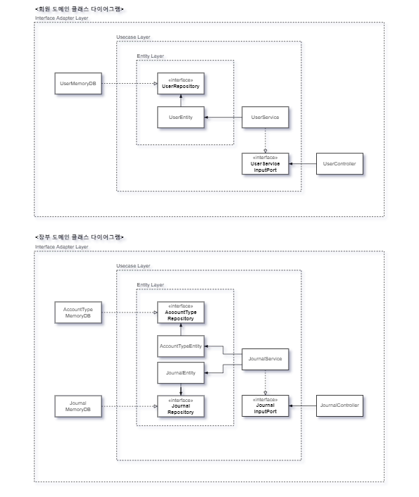

# 1. 목적
- 웹 개발 토이 프로젝트를 하며 스프링과 ORM 등을 공부하며 및 익히기
- 높은 확장성과 낮은 유지보수 비용을 가지는 시스템을 만들기 위해 클린 아키텍처를 참고하며 개발하기
- SOLID 원칙 신경쓰며 개발하기
- TDD 적용

# 2. 프로젝트 설정
## 요구사항
- 회원 가입과 로그인 기능만 구현
  - 서비스 이용 가능 확인 용도로 활용 예정
  - 그러므로, 삭제는 구현 미정 상태
- 입출금 내역을 복식부기 형태로 조회
- 회원은 자신의 용돈 입출금 내역을 기록 가능
  - 용돈 내역은 복식부기로 저장
  - 입출금 기록 시 장부 갱신
- 자신 순자본(현금) 현황은 항상 확인 가능
  - 입출금 기록 시 내역 전체 현황 갱신

## 진행 상황 (진행 중)
- 현재, 스프링 MVC 나 JPA 적용 없이 순수 스프링만 활용 중
  - 로컬에서 웹이나 연결 없이 서비스 테스트 완료 후 웹 관련 코드 보완 예정
  - DB 도 메모리 DB 로 1차 검증 후 외부 DB 연결 예정(외부 DB 미정)
- 회원 도메인과 관련하여 각 계층별 테스트 및 서비스 코드 작성 현황
  - 기능
    - 조회
    - 생성
- 장부 관련 각 계층별 테스트 및 서비스 코드 작성 현황
  - 기능
    - 유저 ID 별 모든 분개장 조회
    - 입출금 코드에 따라 계정과목별 분개장 생성 및 저장

# 3. 설명
## 프로젝트 구조
- entity : 핵심 업무 규칙
  - 도메인 객체와 핵심 업무 규칙 코드 작성
- usecase : 애플리케이션 업무 규칙
  - 특정 핵심 업무 규칙에 추가적으로 필요한 비즈니스 로직 작성
- adapter : 외부 프레임워크와 연결 담당
  - 웹이나 DB 연결을 위한 코드 작성

## TDD 적용
- 테스트 코드는 각 패키지(레이어) 별로 작성 (entity, usecase, adapter)
  - 하위 레이어 먼저 서비스 로직 및 테스트 코드 작성하며 테스트
  - 하위 레이어의 모든 로직이 테스트 통과하면 다음 레이어의 서비스 로직 및 테스트 작성
- 각 테스트가 실행 전 @BeforeTest 로 초기화
  - 원할한 테스트 진행을 위해 컴포넌트 스캔을 하는 AutoConfig 클래스를 만들고 테스트 코드에서 빈 참조 활용
- given, when, then 형식
- 테스트를 통해 예외 처리 또한 검증

## 다이어그램
### 클래스

